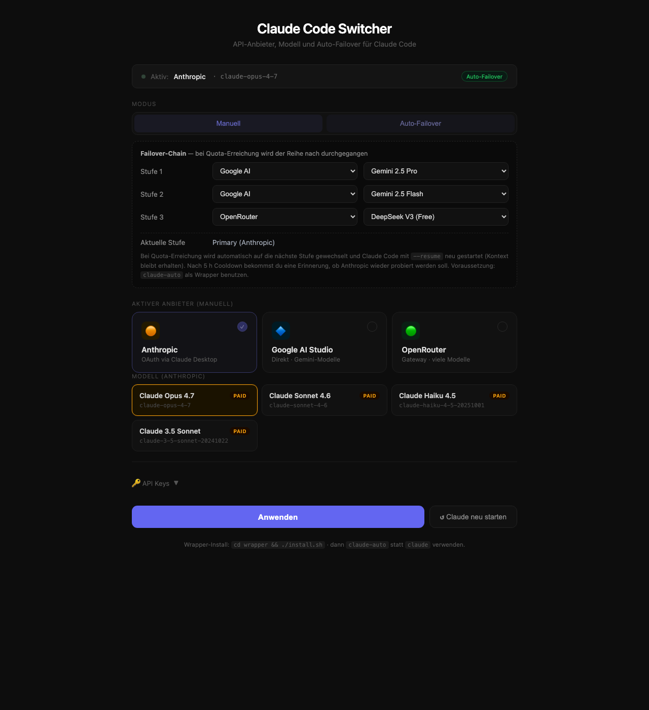
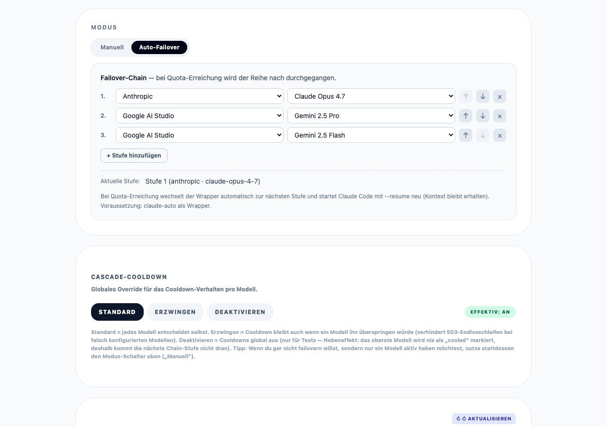
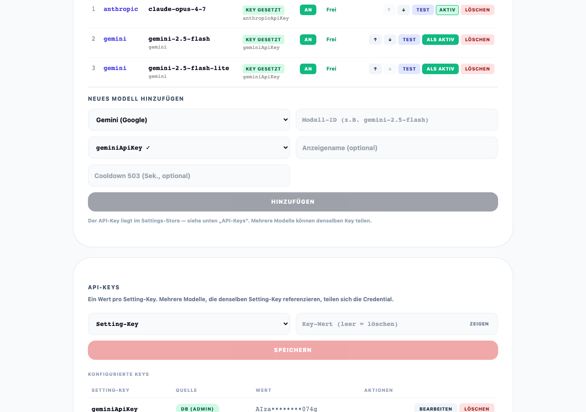
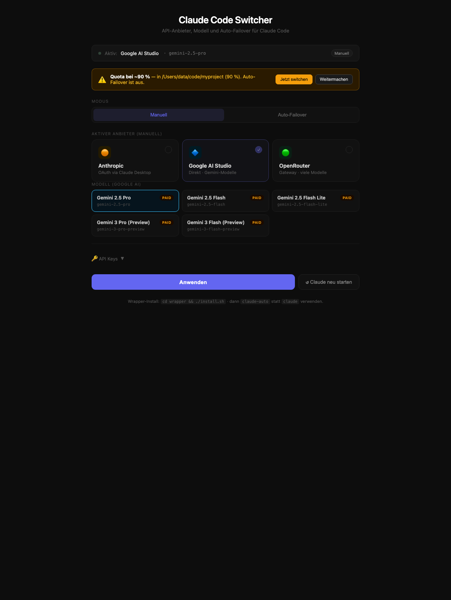

# Claude Code Switcher

> Auto-Failover für [Claude Code](https://claude.com/claude-code): wenn dein Anthropic-Pro/Max-Quota leerläuft, wechselt das Tool automatisch auf Gemini (oder OpenRouter) und springt nach Cooldown selbst zurück. **Du tippst weiterhin nur `claude`** im Terminal — der Chat-Verlauf bleibt erhalten.



*Web-UI auf `http://localhost:2000` — Failover-Chain editierbar, Provider/Modell jederzeit manuell wechselbar.*

> **🧠 Supermodell-Modus** (Opus orchestriert + delegiert Fleißarbeit an günstigere/lokale Modelle; 2 Achsen Pool × Supermodell, Local fail-closed): siehe **[SUPERMODELL.md](SUPERMODELL.md)** — self-contained Anleitung inkl. Laien-Erklärung, 2D-Matrix, Setup (Mac/Ubuntu), Hardware-Stufen, Privacy-Garantie und **Zusammenspiel mit superpowers** (Claude-Code-Arbeitsmodus — Playbook × Staffing, inkl. All-lokal-Sonderfall).

### UI-Bereiche

<table>
<tr>
<td width="50%">

**Auto-Failover — Chain-Editor**



Modus-Umschalter (Manuell / Auto-Failover) + editierbare Failover-Chain mit ↑↓×-Buttons

</td>
<td width="50%">

**Modell-Verwaltung**



Cascade-Modelle mit Toggle, Test, Re-Enable, Löschen + Neues-Modell-Formular

</td>
</tr>
<tr>
<td width="50%">

**API-Keys**


Setting-Key-basierte Key-Verwaltung — mehrere Modelle können einen Key teilen

</td>
<td width="50%">

**Gemini aktiv (nach Failover)**



Status-Bar zeigt aktiven Provider nach Auto-Switch

</td>
</tr>
</table>

---

## Inhalt

- [Was es macht](#was-es-macht)
- [Wie es funktioniert — die Café-Analogie](#wie-es-funktioniert--die-café-analogie)
- [Quick Start](#quick-start)
- [Setup macOS / Linux](#setup-macos--linux)
- [Setup Windows (PowerShell)](#setup-windows-powershell)
- [UI bedienen](#ui-bedienen)
- [Failover-Chain](#failover-chain)
- [Cascade-Struktur](#cascade-struktur)
- [Was kostet was](#was-kostet-was)
- [Datenschutz](#datenschutz)
- [Architektur](#architektur)
- [Trade-offs](#trade-offs)
- [Troubleshooting](#troubleshooting)

---

## Was es macht

- Du arbeitest mit `claude` wie immer.
- **Bei ~ 90 % Quota** → macOS/Windows-Notification + UI-Banner. Du entscheidest selbst.
- **Bei 100 % Quota** → automatischer Switch zur nächsten Failover-Stufe (Default: Gemini 2.5 Pro). Claude wird mit `--resume` neu gestartet, Kontext bleibt voll erhalten.
- **Alle 30 min** wird probiert ob Anthropic wieder verfügbar ist — sobald ja, automatisch zurück (kostenlos).

Default-Chain: `Anthropic Pro/Max → Gemini 2.5 Pro → Gemini 2.5 Flash → DeepSeek free`. Im UI editierbar.

---

## Wie es funktioniert — die Café-Analogie

Stell dir vor, du sitzt in einem Coworking-Café und brauchst einen Berater der dir beim Programmieren hilft. Im Café arbeiten drei Berater:

| Wer | Wie er bezahlt wird | Wie viele Fragen pro Tag? |
|---|---|---|
| 🟠 **Anton** (Anthropic Claude) | dein Monats-Abo, du zahlst nichts extra pro Frage | begrenzt — irgendwann sagt er „Pause, in 5 h wieder" |
| 🔷 **Gabi** (Google Gemini) | pro Frage ein paar Cent | praktisch unbegrenzt |
| 🟢 **Dieter** (DeepSeek) | gratis | sehr begrenzt, langsam, manchmal komisch |

### Vor diesem Tool — das alte Problem

```
09:00 ─ Du gehst zu Anton ──► arbeitest
11:30 ─ Anton: "Pause! In 5 h wieder."
        Du steckst fest. Wartest. Verlierst Zeit. 😤
14:00 ─ Anton ist wieder frei ──► weiterarbeiten
```

Dazwischen 2,5 Stunden Zwangspause — oder du musst manuell zu Gabi gehen, ihr alles neu erklären, deinen ganzen Stand schildern.

### Mit diesem Tool

Du tippst weiterhin nur `claude`. Im Hintergrund läuft ein „unsichtbarer Assistent" mit, der drei Sachen macht:

```
┌───────────────────────────────────────────────────────────┐
│  1. ZUHÖREN                                              │
│     Hört dem Berater zu und merkt wenn der sagt          │
│     "ich bin fast leer" (90 %) oder "Pause!" (100 %)     │
└───────────────────────────────────────────────────────────┘
                          ▼
┌───────────────────────────────────────────────────────────┐
│  2. UMSCHALTEN                                           │
│     Bei "Pause!" schubst er Anton vom Tisch und          │
│     setzt Gabi hin. Gabi kriegt blitzschnell den         │
│     bisherigen Gesprächsverlauf in die Hand gedrückt     │
│     und macht nahtlos weiter.                            │
└───────────────────────────────────────────────────────────┘
                          ▼
┌───────────────────────────────────────────────────────────┐
│  3. BEOBACHTEN                                           │
│     Alle 30 Minuten geht er rüber zu Anton und schaut    │
│     "bist du wieder bereit?" Sobald ja — Gabi geht,      │
│     Anton kommt zurück. Wieder kostenlos für dich.       │
└───────────────────────────────────────────────────────────┘
```

### Beispiel-Tag

```
09:00 ─ Du tippst `claude`, Anton hilft dir              💰 0 €
11:30 ─ Anton: "Pause!" → Switcher schubst zu Gabi
        Du merkst nur kurz: Claude wird neu gestartet (5 s)
        Du tippst weiter genau wo du aufgehört hast
12:00 ─ Switcher checkt: Anton noch in Pause? → ja
12:30 ─ Switcher checkt: Anton noch in Pause? → ja
13:00 ─ Switcher checkt: Anton noch in Pause? → ja
13:30 ─ Switcher checkt: Anton noch in Pause? → ja
14:00 ─ Switcher checkt: Anton bereit! → Gabi geht,
        Anton ist wieder da. Du arbeitest weiter.        💰 0 €
        Du warst 2,5 h auf Gabi → Kosten ~ 1,50 €
```

### Noch einen Schritt weiter — der Supermodell-Modus

Der Failover oben ist **Plan B**: Anton fällt aus, Gabi springt ein. Reaktiv — erst wenn das Limit schon weg ist.

Der **Supermodell-Modus** dreht das zu **Plan A** um. Anton (der teure Senior) macht nur noch das, wofür man einen Senior *braucht* — **planen und am Ende drüberschauen**. Die Fleißarbeit gibt er sofort an die günstigen Kollegen, **bevor sein Limit überhaupt angekratzt wird**:

```
   Du: "Bau Feature X, mit Tests, und committe es"
                     │
                     ▼
   🟠 Anton PLANT ──► verteilt die Aufgaben:
        ├─ Code tippen     ──►  🟢 Dieter / 🔷 Gabi   (billig/gratis)
        ├─ Tests prüfen    ──►  ein Review-Kollege
        └─ Commit-Message  ──►  der billigste im Haus
                     │
                     ▼
   🟠 Anton sammelt ein, prüft, poliert  ──►  fertig
```

Der Witz: Anton wird **gar nicht erst leer**, weil er 95 % der Arbeit delegiert. Statt „ein teurer Berater macht alles bis er umfällt" → „ein teurer Kopf plant, ein Schwarm billiger Hände arbeitet". Viele Modelle, die sich wie **ein** überlegenes verhalten — daher *Super*modell.

Gesteuert über zwei Achsen: **welcher Pool** (Cloud = beste Qualität · Free = gratis · Lokal = privat, nichts verlässt den Rechner) und **Supermodell an/aus**. Wer welche Aufgabe kriegt, entscheidet Anton anhand von **Beschreibungen** (kein fester Code) — die ganze Mechanik (Rollen, Routing, Privacy-Garantie, Hardware-Stufen) steht in **[SUPERMODELL.md](SUPERMODELL.md)**.

**Auch das Hirn ist konfigurierbar.** Der `orchestrator` ist eine eigene Rolle (Zelle pro Pool) wie `implement`/`review`/… — und knallt Opus *selbst* ans Limit, schaltet er der Reihe nach durch die Modelle dieser Zelle (Default cloud: **Sonnet 4.6 → Gemini**). Sonnet zuerst **Anthropic-direkt** (Supermodell bleibt intakt, Subagents laufen), dann degradiert-aber-läuft via Cloud; nach Cooldown promotet er automatisch zurück auf Opus. Reihenfolge editierbar wie jede Rolle (die Kette folgt der Zelle, kein Code-Eingriff). Im **Lokal**-Pool: kein Cloud-Ausweich — **fail-closed**.

**Wann lohnt sich das?** Je öfter du an Antons „Pause!" knallst, je mehr stumpfe Fleißarbeit du hast, je wichtiger dir Lokal/Privatsphäre ist. Knallst du nie ans Limit und brauchst kein Lokal → bleib beim einfachen Failover oben; dann ist Supermodell Overkill.

### Eine Frage, drei Türen — und warum Switcher alle drei hat

Unter der Haube läuft alles über **eine** Maschine (`llm-cascade`): jede Anfrage muss in genau **ein** Fach — *„welcher Spezialist macht das?"*. Es gibt drei Türen zur Antwort, mit fester Präzedenz:

```
 ① Der CHEF labelt explizit   → der Orchestrator hat den Job zerlegt und
   (category im Body)            weiß "das ist ein review"        → SUPERMODELL
   │   schlägt …
 ② DU legst den Hebel um      → "alles nach Cloud / nach Lokal"
   (preferredCategory)                              → Pool-Toggle in der UI
   │   schlägt …
 ③ Der SCANNER rät            → liest den Inhalt: "das ist eine Übersetzung"
   (Semantic Router)                                → wie EduPro es macht
```

Der Switcher nutzt dieselbe Maschine wie die Schwester-Plattform **EduPro** — und hat damit **alle drei Türen**. EduPro lebt auf ③ (Inhalt raten, 1 Achse: Content/Dev/Utility/General); der Switcher-Supermodell-Modus dreht das um und nutzt ① (der Chef weiß die Rolle vorher, 2 Achsen: Rolle × Pool). Ohne Agent und ohne Hebel würde auch der Switcher einfach semantisch raten. Ganzes Bild mit Diagrammen + Vergleichstabelle: **[SUPERMODELL.md](SUPERMODELL.md#supermodell-vs-edupros-semantisches-routing--gleiche-maschine-andere-tür)**.

---

## Quick Start

**Voraussetzungen:**
- Docker — siehe Plattform-Hinweise unten
- Anthropic Pro/Max Account (für die kostenlose Hauptstufe)
- Google AI Studio API-Key ([aistudio.google.com/apikey](https://aistudio.google.com/apikey))
- OpenRouter API-Key (auch für die `:free`-Modelle nötig — [openrouter.ai/keys](https://openrouter.ai/keys))
- Claude Code installiert ([claude.com/claude-code](https://claude.com/claude-code))

**Ein einziges Setup-Skript** — entpackt Source, baut Container, installiert Hook + CLAUDE.md-Block, setzt den `claude`-Alias. Komplett, eine Aktion.

```bash
# macOS / Linux / WSL2
curl -O https://raw.githubusercontent.com/4dataclub/claude-code-switcher/main/setup.sh
chmod +x setup.sh && ./setup.sh
# Terminal neu öffnen → claude funktioniert
```

```powershell
# Windows native (PowerShell)
Invoke-WebRequest -Uri https://raw.githubusercontent.com/4dataclub/claude-code-switcher/main/setup.ps1 -OutFile setup.ps1
.\setup.ps1
# PowerShell neu öffnen → claude funktioniert
```

Was das Skript automatisch macht:
1. Entpackt alle Source-Files nach `./claude-switcher/` (inkl. 8 Doku-Screenshots)
2. Schreibt `~/.claude/CLAUDE.md`-Block (für Chat-Switching: „wechsel auf gemini pro")
3. Legt `~/.claude/hooks/switcher-banner.sh` (oder `.ps1`) an
4. Registriert den `UserPromptSubmit`-Hook in `~/.claude/settings.json`
5. Baut + startet den Docker-Container
6. **Setzt den `claude`-Alias** in `~/.zshrc`/`~/.bashrc` bzw. `$PROFILE`

Danach nur noch: Terminal neu öffnen + API-Keys auf [http://localhost:2000](http://localhost:2000) eintragen → fertig.

---

## Setup macOS

**Docker installieren:**
```bash
# Variante 1: Docker Desktop von docker.com
# Variante 2: per Homebrew
brew install --cask docker
```

Dann:
```bash
curl -O https://raw.githubusercontent.com/4dataclub/claude-code-switcher/main/setup.sh
chmod +x setup.sh && ./setup.sh
# Terminal neu öffnen → claude funktioniert
```

---

## Setup Linux (Ubuntu/Debian/Fedora/Arch)

Linux braucht keinen Docker Desktop — die schlankere **Docker Engine** reicht völlig:

```bash
# Ubuntu / Debian
sudo apt-get update
sudo apt-get install -y docker.io docker-compose-plugin
sudo usermod -aG docker "$USER"   # damit du ohne sudo arbeitest
newgrp docker                     # Gruppe sofort aktivieren ohne Logout

# Fedora
sudo dnf install -y docker docker-compose-plugin
sudo systemctl enable --now docker
sudo usermod -aG docker "$USER" && newgrp docker

# Arch
sudo pacman -S --noconfirm docker docker-compose
sudo systemctl enable --now docker
sudo usermod -aG docker "$USER" && newgrp docker
```

Dann:
```bash
curl -O https://raw.githubusercontent.com/4dataclub/claude-code-switcher/main/setup.sh
chmod +x setup.sh && ./setup.sh
# Terminal neu öffnen → claude funktioniert
```

> Alle Bash-Hooks, der Watcher (`router-watch.sh`), der Wrapper (`claude-auto`) und die `settings.json`-Mergung sind plattformidentisch zu macOS — Linux ist hier der „Standard-Pfad".

---

## Setup Windows

**Variante A — Native PowerShell** (Docker Desktop):
```powershell
# Docker Desktop von docker.com installieren (WSL2-Backend default)
Invoke-WebRequest -Uri https://raw.githubusercontent.com/4dataclub/claude-code-switcher/main/setup.ps1 -OutFile setup.ps1
.\setup.ps1
# PowerShell neu öffnen → claude funktioniert

# Optional für hübsche Notifications
Install-Module -Name BurntToast -Scope CurrentUser -Force
```

`setup.ps1` legt unter Windows analog zu setup.sh die `~\.claude\hooks\switcher-banner.ps1` und `settings.json` mit `powershell.exe`-Hook-Eintrag an, und setzt die `claude`-Funktion im PowerShell-Profil — alles in einem Aufruf.

**Variante B — WSL2** (Linux IN Windows, einfacher zu warten):
```powershell
wsl --install                          # einmalig, dann Reboot
# in WSL-Ubuntu-Shell:
sudo apt-get install -y docker.io docker-compose-plugin
sudo usermod -aG docker "$USER" && newgrp docker
curl -O https://raw.githubusercontent.com/4dataclub/claude-code-switcher/main/setup.sh
./setup.sh
```

WSL2 läuft *in* Windows — kein zweites Gerät, kein Cloud-VM. Innerhalb WSL ist alles identisch zu Linux.

---

## UI bedienen

`http://localhost:2000` zeigt:

1. **Status-Zeile** oben: aktueller Provider, Modell, Modus, Position in der Failover-Chain.
2. **Steuer-Toggles**: **Supermodell** (An/Aus) · **Bereich** (Cloud/Free/Lokal) · **Switching** (Manuell/Auto-Failover). Der Supermodell-Modus ist in [SUPERMODELL.md](SUPERMODELL.md) erklärt.
3. **Failover-Chain** (im Auto-Modus): editierbar (Provider + Modell je Stufe).
4. **Modell-Tabelle**: aktivieren/deaktivieren pro Modell + grüner **„Als aktiv"**-Button = manueller Live-Switch auf genau dieses Modell (gefiltert über den Bereich-Toggle). Einen separaten „Wechseln-zu"-Picker gibt es nicht mehr.
5. **API Keys**: die Schlüssel landen im geteilten Key-Store **`app_settings` (DB)** — derselbe Store, aus dem `llm-cascade` liest und auf den der Router via `resolveKey()` zugreift. **Anthropic-Feld kann leer bleiben** (OAuth via Claude Desktop); der Anthropic-OAuth/Long-Token bleibt in `~/.claude/settings.json` (der Wrapper braucht ihn dort).

---

## Failover-Chain

Default-Reihenfolge wenn Anthropic-Quota leer ist:

| Stufe | Provider | Modell | Kosten/Session¹ | Hinweis |
|---|---|---|---|---|
| 0 | Anthropic | OAuth (Pro/Max) | im Abo enthalten | beste Tool-Use-Qualität |
| 1 | Google AI | `gemini-2.5-pro` | ~ 1,00 € | Reasoning immer an |
| 2 | Google AI | `gemini-2.5-flash` | ~ 0,28 € | ¼ Pro-Kosten, gute Code-Qualität |
| 3 | OpenRouter | `deepseek/deepseek-chat-v3:free` | 0 € | rate-limited, Notnagel |

¹ Schätzung für ~500 K Input + 50 K Output Tokens. Tatsächliche Kosten variieren.

Im UI editierbar — du kannst je Stufe Provider und Modell ändern.

---

## Cascade-Struktur

Der Switcher verwaltet seine Modelle in zwei unabhängigen Cascades, die im
Admin-UI als separate Tabs sichtbar sind (`<ki-cascades-view>`):

```
┌─ free-only ──────────────────┐   ┌─ cloud ──────────────────────┐
│ deepseek/deepseek-v3 (free)  │   │ claude-opus-4-7 (Anthropic)  │
│ llama-3.3-70b (free)         │   │ gemini-2.5-pro (Google)      │
│ gemma-3-4b (free)            │   │ gpt-oss-120b (OpenRouter)    │
│                              │   │                              │
│ cooldown: keiner             │   │ cooldown: 32 s (Standard)    │
│ (kostenlos, Rate-Limitiert)  │   │ (eigener unabhängiger Timer) │
└──────────────────────────────┘   └──────────────────────────────┘
```

**Warum zwei getrennte Bereiche?**

| | `cloud` | `free-only` |
|---|---|---|
| **Kosten** | bezahlt (API-Abrechnung) | kostenlos |
| **Qualität** | hoch | variabel |
| **Cooldown** | eigener Timer (llm-cascade) | nicht nötig — kein Rate-Limit-Risiko |
| **Typischer Einsatz** | Hauptarbeit, komplexe Tasks | Notnagel bei Quota-Leer |

Die Trennung ist semantisch grundverschieden von EduPro (`utility`/`content`
nach Task-Typ) — hier geht es um **Kosten-Tier**, nicht um den Verwendungszweck.
Beide Apps nutzen dieselbe `@4dataclub/ki-models-ui` Library; die Kategorienamen
kommen direkt aus der Datenbank und werden als Tab-Titel angezeigt.

---

## Was kostet was

### Pro durchschnittliche 1–2-Stunden-Coding-Session

| Modell | Kosten | Vergleich |
|---|---|---|
| Anthropic (Pro/Max-Abo) | 0 € | im Abo enthalten |
| Gemini 2.5 Pro | ~ 1,00 € | wie ein Cappuccino |
| Gemini 2.5 Flash | ~ 0,28 € | wie ein Stück Kaugummi |
| Gemini 2.5 Flash Lite | ~ 0,07 € | Centbetrag |
| DeepSeek free | 0 € | aber: oft „kann gerade nicht antworten" |

### Was ist eine „Session"?

Eine Session = von „claude starten" bis „claude beenden". Typisch 30 Min – 2 h Arbeit. Vergleichbar mit einem längeren WhatsApp-Chat zu einem Thema.

**Wichtig zur Abrechnung:** Bei jeder neuen Frage liest der Berater den ganzen bisherigen Gesprächsverlauf nochmal durch — und stellt das in Rechnung. Wie eine Pizza die du teilst: jedes neue Stück = du zahlst irgendwie auch nochmal für die ganze Pizza. **Längere Sessions kosten überproportional mehr als kurze.**

### Realistische Tagesabläufe

| Szenario | Tag | Mehrkosten |
|---|---|---|
| **Typischer Tag** | 4 h, 2 Sessions, Anthropic reicht | 0 € |
| **Produktiver Tag** | 8 h, nachmittags Anthropic leer, 2 Sessions auf Gemini Pro | ~ 2 € |
| **Intensiver Tag** | 10 h durchgehend, mittags leer, ganzen Nachmittag Pro | ~ 5 € |
| **Worst Case** | Anthropic-Outage, ganzen Tag nur Gemini Pro | ~ 5–6 € |

**Realistisch übers Jahr:** Wenn 1–2× pro Woche das Anthropic-Quota leerläuft → 5–15 € Mehrkosten / Monat.

### Geschwindigkeit

| Aktion | Claude | Gemini Pro | Gemini Flash |
|---|---|---|---|
| Erste Antwort kommt nach… | 1–3 s | **5–15 s** (Thinking läuft) | 1–3 s |
| Code-Edit ausführen | sofort, präzise | etwas zögerlich | flott, aber „schlampiger" |
| Mehrstufige Aufgabe (Plan + 5 Edits) | 2–4 Min | 4–7 Min | 3–5 Min |

Pro fühlt sich wie 1,5–2× langsamer pro Antwort an. Bei einfachen Edits kein Unterschied. Bei komplexen Tasks: ~ 20–40 % mehr eigene Steuerung nötig.

---

## Datenschutz

### Free vs. Paid Tier (Google AI Studio)

| Tier | Training auf Inputs? | Erkennen? |
|---|---|---|
| Free | **Ja** (offizielle Policy) | Concurrency-Test: 3+ parallele Requests → einige werfen HTTP 429 |
| Paid (Billing aktiv) | **Nein** | Concurrency-Test: alle 200 OK |

Den API-Tier-Status checkst du in [console.cloud.google.com/billing](https://console.cloud.google.com/billing) — wenn das mit dem AI-Studio-Projekt verknüpfte Cloud-Projekt einen Billing-Account hat, ist Paid aktiv.

**Family-Plan ≠ API-Tier.** Gemini Advanced (Web-UI im Family-Plan) und Google AI Studio API sind unabhängig.

### Was Google paid zusätzlich tut (vs. nicht tut)

| Aktion | Paid Gemini API | Anthropic (zum Vergleich) |
|---|---|---|
| Zum Training nutzen | ❌ Nein | ❌ Nein |
| An Dritte weitergeben | ❌ Nein | ❌ Nein |
| Kurzzeitig speichern für Missbrauchs-Erkennung | ✅ ~ 24 h, in seltenen Fällen länger bei flagged content | ✅ ~ 30 Tage |
| Von Mitarbeitern einsehbar | ⚠️ Nur bei Security-Incidents (signed access logs) | ⚠️ Gleiche Praxis |

**Praktisches Fazit:** Paid Gemini ≈ Anthropic-Niveau. Für reguläres Coding bedenkenlos. Für streng vertrauliche Daten (Bankgeheimnisse, Patientendaten, Kunden-Geheimnisse) gilt für beide Provider: Datenschutzbeauftragten fragen.

---

## Geteilte Library: @4dataclub/ki-models-ui

Die komplette Admin-UI (Modell-Verwaltung, API-Keys, Cascade-Config, Failover-Chain)
wird durch die gemeinsame Angular-Library [`@4dataclub/ki-models-ui`](https://github.com/4dataclub/ki-models-ui)
gerendert — dieselbe Library wie in EduPro, kein doppelter Code.

```
┌─ Switcher Angular-Frontend ─────────────────────────────────────────┐
│  app.component.ts:                                                   │
│    <ki-cascade-cooldown>  — Cooldown Tri-State                       │
│    <ki-models-table>      — Modell-Liste + Toggle + Test + Delete    │
│    <ki-add-model-form>    — Neues Modell hinzufügen                  │
│    <ki-api-keys-section>  — API-Keys verwalten                       │
│                                                                      │
│  mode-panel.component.ts (Switcher-own):                             │
│    <ki-failover-chain>    — Failover-Reihenfolge + Promote-Button    │
│                                                                      │
│  banner.component.ts / status-bar.component.ts (Switcher-own)       │
└─────────────────────────────────────────────────────────────────────┘
         ↓ HTTP via KiModelsApiService (KI_MODELS_API_BASE = /api)
┌─ Switcher Backend /api/* ───────────────────────────────────────────┐
│  ai-models · api-keys · cascade-config  (eigene Postgres-Tabellen)  │
└─────────────────────────────────────────────────────────────────────┘
```

---

## Architektur

```
┌─────────────────────────────────────────────────────────────────────┐
│ claude-auto (Bash- bzw. PowerShell-Wrapper)                         │
│   • startet `claude`, hält stdin/stdout/stderr durch                │
│   • Background-Watcher 1: parst stderr nach 90 % / Quota-Patterns   │
│   • Background-Watcher 2: pollt ~/.claude/.switcher-restart Marker  │
│   • Restart-Logik: kill claude → claude --resume <session>          │
└────────┬────────────────────────────────────────────────────────────┘
         │ HTTP zu localhost:2000
         ▼
┌─────────────────────────────────────────────────────────────────────┐
│ switcher-frontend (Angular/nginx, Port :2000)                       │
│   • UI: http://localhost:2000                                       │
│   • ki-models-ui Library-Components + Mode-Panel + Status-Bar       │
│   • Proxy: /api/* → switcher-backend intern                         │
└────────┬────────────────────────────────────────────────────────────┘
         │ /api/* (intern)
         ▼
┌─────────────────────────────────────────────────────────────────────┐
│ switcher-backend (Spring Boot, intern :2000)                        │
│   • API: /api/switch /api/auto /api/quota-error /api/warn …        │
│   • State: ~/.claude/settings.json (._switcher block)               │
│   • AutoPromoteService: alle 30 min Auto-Promote-Check              │
│   • Schreibt router-config.json + restartet Router-Container        │
│     via Docker-Socket                                               │
└────────┬──────────────────────────────┬──────────────────────────────┘
         │                              │
         ▼                              ▼
┌────────────────────────┐  ┌──────────────────────────────────────┐
│ db (PostgreSQL 16)     │  │ llm-cascade (Spring Boot, :8090)     │
│ Volume: switcher_pgdata│  │ AI-Modell-Config + Cascade-State     │
└────────────────────────┘  └──────────────────────────────────────┘

┌─────────────────────────────────────────────────────────────────────┐
│ claude-code-router (Docker-Container, ccr auf :3456)                │
│   • Image: node:20-alpine + npm i -g @musistudio/claude-code-router │
│   • Übersetzt Anthropic-Messages-API ↔ Google AI / OpenRouter       │
│   • Wird nur genutzt wenn Provider ≠ Anthropic                      │
└─────────────────────────────────────────────────────────────────────┘
```

**Anthropic-Modus läuft nicht durch den Router** — OAuth (Pro/Max) braucht direkten Zugriff auf `api.anthropic.com`, weil Claude Desktop die Tokens verwaltet.

### Chat-History bleibt erhalten

Claude Code persistiert jede Session als JSONL-Datei in `~/.claude/projects/<encoded-cwd>/<uuid>.jsonl`. Beim Restart findet der Wrapper die zuletzt-modifizierte JSONL und ruft `claude --resume <uuid>` auf. Das neue Modell liest die volle History inkl. Tool-Calls und kann nahtlos weiterarbeiten.

### API-Endpunkte

| Endpoint | Methode | Zweck |
|---|---|---|
| `/api/status` | GET | aktueller Provider, Modell, Modus, Chain-Position, Keys (masked) |
| `/api/whoami` | GET | Plain-Text-Identität: aktuelles Modell + Provider + Hersteller |
| `/api/switch` | POST | manueller Provider/Modell-Switch |
| `/api/auto` | GET/POST | Auto-Modus an/aus, Chain editieren |
| `/api/quota-error` | POST | Wrapper meldet 429 → Server rückt Chain vor |
| `/api/warn` | POST | Wrapper meldet 90 %-Pattern |
| `/api/chain-promote` | POST | manueller Reset zu Anthropic |
| `/api/recheck-now` | POST | erzwingt sofortiges Auto-Promote (Cooldown übergehen) |
| `/api/events` | GET (SSE) | Live-Updates an UI |

---

## Trade-offs

- **stderr-Parsing fragil** — die Patterns in `wrapper/claude-auto` (`WARN_RE` / `ERROR_RE`) sind editierbar falls Anthropic die Wortwahl seiner Quota-Warnungen ändert.
- **Keine offizielle Pre-Quota-API für Pro/Max-OAuth.** Anthropic stellt kein Subscription-Usage-Endpoint bereit — die einzige Quelle ist der Live-Output von Claude Code.
- **Kein OAuth-Pass-through-Proxy** für den Anthropic-Modus implementiert. Würde exakte Rate-Limit-Headers liefern, aber Token-Refresh-Konflikt mit Claude Desktop ist riskant.
- **Docker-Socket-Mount** im Switcher-Container nötig für Router-Restart → effektiv Root-Rechte. Lokales Dev-Tool, **nicht** auf Server deployen.
- **Cooldown ist time-based**, nicht API-probed. Nach 30 min wird einfach versucht — wenn Anthropic noch voll, kostet der Doppel-Restart ~ 10 s.
- **Mehrere parallele `claude-auto`-Instanzen** können beim Restart die falsche Session resumen (`latest jsonl`-Heuristik).
- **Pro-Modelle haben Reasoning immer aktiv** → ~ 3× Output-Token-Kosten gegenüber Flash.

---

## Troubleshooting

**„Provider zeigt OpenRouter/DeepSeek statt Anthropic"** — manuell im UI auf Anthropic klicken + Anwenden, oder:
```bash
curl -X POST http://localhost:2000/api/chain-promote
```

**Router-Container restartet ständig** — `docker compose down && docker compose up -d --build`. Sollte mit dem aktuellen `command:` im `docker-compose.yml` stabil sein (Daemon-Watching via `pgrep`).

**„Quota erreicht" ohne dass etwas switcht** — Auto-Modus muss im UI aktiv sein. Status checken:
```bash
curl http://localhost:2000/api/status
```

**Windows-Notifications kommen nicht** — `Install-Module BurntToast -Scope CurrentUser` ausführen, oder im Konsolen-Output nach `▸ Switcher:`-Meldungen Ausschau halten.

**`bash setup.sh` funktioniert auf Windows nicht** — [Git for Windows](https://git-scm.com/download/win) installieren bringt Git Bash mit, oder WSL2 nutzen.

**Container-Namen-Konflikt nach Setup-Wechsel** — alte Container räumen:
```bash
docker stop claude-switcher-backend-1 claude-switcher-frontend-1 \
            claude-switcher-router-1 claude-switcher-llm-cascade-1 \
            claude-switcher-db-1
docker rm   claude-switcher-backend-1 claude-switcher-frontend-1 \
            claude-switcher-router-1 claude-switcher-llm-cascade-1 \
            claude-switcher-db-1
```

**Settings/Keys gehen verloren** — der `_switcher`-State (Provider, activeRoute, …) + der Anthropic-OAuth/Token liegen in `~/.claude/settings.json`; die **Google/OpenRouter-API-Keys** liegen in der **DB** (`app_settings`, Volume `switcher_pgdata`) — derselbe Store, den `ki-models-ui` pflegt. Beides überlebt Container-Restarts; fürs Backup beide sichern. `docker compose down -v` löscht das DB-Volume (= die Keys).

---

## Stoppen / Aufräumen

```bash
docker compose down                          # Container weg, Image bleibt
docker compose down --rmi all -v             # auch Image + Volumes weg
```

Wrapper-Alias entfernen: die Zeilen zwischen `# === claude-switcher ===` und `# === /claude-switcher ===` aus `~/.zshrc` (macOS) bzw. `$PROFILE.CurrentUserAllHosts` (Windows) löschen.

---

## Lokale Modelle (optional, Profile `local-llm`)

Default startet der Switcher OHNE Ollama — die meisten Nutzer:innen
wollen ja zwischen Cloud-Providern (Anthropic / Google / OpenRouter)
switchen, nicht ein 3-GB-Modell lokal laufen lassen.

Wer trotzdem lokal kostenlos generieren will:

```bash
docker compose --profile local-llm up -d
```

Das startet einen zusätzlichen `claude-switcher-ollama-1` Container der
beim ersten Start `gemma3:4b` (~3.3 GB) zieht. Aus dem Switcher-UI:

1. „KI-Modelle" → „Modell hinzufügen" → Provider `ollama`, Modell-ID
   `gemma3:4b`, Kategorie `free-only` (oder eigene).
2. „Test" sollte jetzt ✓ zurückgeben.

Anderes Modell statt gemma:

```bash
docker exec claude-switcher-ollama-1 ollama pull llama3.2:3b
```

Dann im UI das Modell mit ID `llama3.2:3b` anlegen.

**Warum opt-in?** Ohne das Profile startet Ollama nicht — der Cascade
wirft beim Test einen sprechenden „Ollama unreachable"-Fehler statt zu
crashen. Modelle die andere Provider nutzen funktionieren unverändert
weiter.

---

## Sicherheit

- **Niemals** `~/.claude/settings.json` committen — enthält API-Keys.
- **Niemals** Keys in Notizen, Screenshots oder Issues posten.
- Bei versehentlichem Push: Key sofort revoken, dann `git filter-repo --replace-text` oder BFG für die Git-History.
- `.gitignore` blockiert `settings.json`, `.env`, `router-config.json` — aber prüfe vor jedem Commit nochmal mit `git status` was du hochlädst.

---

## License

MIT — siehe [LICENSE](LICENSE) (sofern vorhanden) oder Standard-MIT-Klausel: free to use, modify, distribute, no warranty.

---

## Entwicklung — Setup-Bundles bauen

Die User-Datei `setup.sh` (Bash, macOS/Linux) und `setup.ps1` (PowerShell, Windows) sind **selbst-extrahierende Bundles** — sie enthalten alle Source-Files (`java-backend/`, `angular-frontend/`, `router/`, `wrapper/`, `docs/`, CLAUDE.md-Block) als Base64-Payload.

**Single Source of Truth:** die echten Source-Files liegen im Repo (`java-backend/`, `angular-frontend/`, `wrapper/`, `docs/screenshots/`, …). Die Bundles sind generiert.

**Nach Source-Änderung Bundles regenerieren:**

```bash
bash scripts/build-setup.sh
git add setup.sh setup.ps1
git commit -m "build: regenerate setup bundles"
git push
```

`build-setup.sh` baut beide Bundles aus:

- `scripts/setup-header.sh.tpl` — Bash-Header
- `scripts/setup-header.ps1.tpl` — PowerShell-Header
- `scripts/templates/CLAUDE.md.tpl` — der CLAUDE.md-Block der ins User-Setup geschrieben wird
- alle Source-Files via Manifest in `build-setup.sh`

→ Wenn du eine neue Datei zum Setup hinzufügen willst: ins MANIFEST in `scripts/build-setup.sh` eintragen + entsprechend im Bash-Header (`extract`-Aufruf) und PS-Header (Decode-Block) ergänzen.

**Wichtig:** Frisch-Installs vom GitHub ziehen IMMER aus den Bundles. Wenn Source und Bundles auseinanderlaufen, läuft der frische Install mit altem Stand. Drum: nach Source-Edit immer Bundles neu bauen (oder einen Pre-Push-Hook setzen, siehe Issues).

---

## Mitarbeit

Issues + Pull Requests willkommen. Vor allem für:

- bessere stderr-Patterns wenn Anthropic seine Wortwahl ändert
- Provider-Konfigurationen für weitere Anbieter
- Sauberer OAuth-Pass-through-Proxy für exakte Pre-Quota-Detection
- UI-Übersetzungen
- Pre-Push Git-Hook der `bash scripts/build-setup.sh` automatisch laufen lässt
