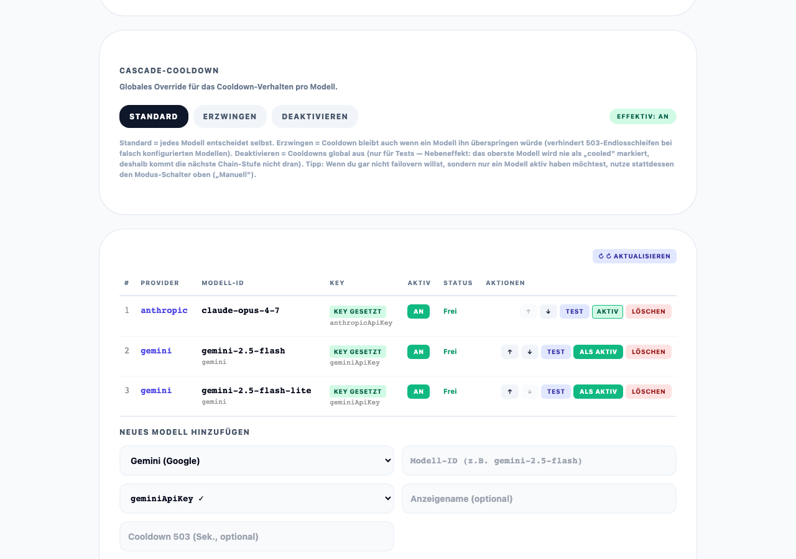
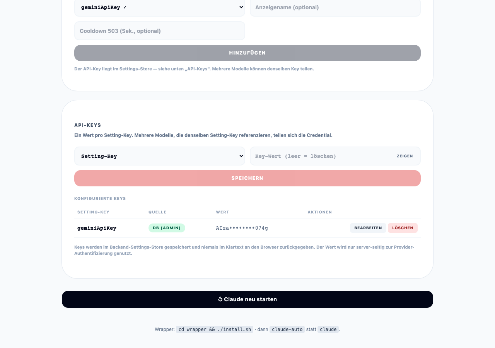

# Claude Code Switcher

> **Open Source, frei für alle** — klonen, starten, weiterarbeiten.

---

## Das Problem

Du bist mitten drin. Der Code fließt, Claude zieht gut mit — und dann:

> ⛔ *„You've reached your usage limit. Try again in 4 hours."*

Alles steht. Genau im Flow. Vier Stunden warten oder zahlen. Jeden Tag aufs Neue.

**Das muss nicht sein.** Es gibt genug andere Modelle, die einspringen könnten —
nur schaltet Claude Code nicht von selbst um. Genau diese Lücke schließt der
Switcher.

---

## Wie es funktioniert — die Café-Analogie

Stell dir vor, du sitzt in einem Coworking-Café und brauchst einen Berater, der
dir beim Programmieren hilft. Im Café arbeiten drei Berater:

| Wer | Wie er bezahlt wird | Wie viele Fragen pro Tag? |
|---|---|---|
| 🟠 **Anton** (Anthropic Claude) | dein Monats-Abo, nichts extra pro Frage | begrenzt — irgendwann „Pause, in 5 h wieder" |
| 🔷 **Gabi** (Google Gemini) | pro Frage ein paar Cent | praktisch unbegrenzt |
| 🟢 **Dieter** (DeepSeek) | gratis | sehr begrenzt, langsam, manchmal komisch |

### Vor diesem Tool — das alte Problem

```
09:00 ─ Du gehst zu Anton ──► arbeitest
11:30 ─ Anton: "Pause! In 5 h wieder."
        Du steckst fest. Wartest. Verlierst Zeit. 😤
14:00 ─ Anton ist wieder frei ──► weiterarbeiten
```

Dazwischen 2,5 Stunden Zwangspause — oder du gehst manuell zu Gabi und musst ihr
deinen ganzen Stand neu erklären.

### Mit diesem Tool

Du tippst weiterhin nur `claude`. Im Hintergrund läuft ein „unsichtbarer
Assistent" mit, der drei Dinge tut:

```
┌───────────────────────────────────────────────────────────┐
│  1. ZUHÖREN                                              │
│     Merkt, wenn ein Berater sagt "ich bin fast leer"     │
│     (90 %) oder "Pause!" (100 %).                        │
└───────────────────────────────────────────────────────────┘
                          ▼
┌───────────────────────────────────────────────────────────┐
│  2. UMSCHALTEN                                           │
│     Bei "Pause!" setzt er Gabi an den Tisch — sie kriegt │
│     den bisherigen Gesprächsverlauf in die Hand und      │
│     macht nahtlos weiter.                                │
└───────────────────────────────────────────────────────────┘
                          ▼
┌───────────────────────────────────────────────────────────┐
│  3. BEOBACHTEN                                           │
│     Alle 30 min schaut er bei Anton "wieder bereit?"     │
│     Sobald ja — Gabi geht, Anton kommt zurück.           │
│     Wieder kostenlos für dich.                           │
└───────────────────────────────────────────────────────────┘
```

### Ein Beispiel-Tag

```
09:00 ─ Du tippst `claude`, Anton hilft dir              💰 0 €
11:30 ─ Anton: "Pause!" → Switcher schubst zu Gabi
        Du merkst nur: Claude startet kurz neu (5 s)
        Du tippst weiter, genau wo du aufgehört hast
12:00–13:30 ─ Switcher checkt alle 30 min: Anton noch in Pause?
14:00 ─ Anton bereit! → Gabi geht, Anton zurück          💰 0 €
        2,5 h auf Gabi → Kosten ~ 1,50 €
```

**Die zwei Fälle, die der Switcher unterscheidet:**
- **Limit leer** (Tageskontingent weg) → er bleibt beim Ausweich-Berater, bis
  Anton wieder da ist — und springt dann **von selbst zurück**.
- **Nur kurz überlastet** (Andrang, Server-Fehler) → kurze Pause (Cooldown), der
  nächste übernimmt solange, danach geht's automatisch zurück.


*Die Reihenfolge, wer einspringt, stellst du hier ein.*

**Manuell oder automatisch — du wählst:**
- **Manuell** — *du* entscheidest, wann und worauf gewechselt wird. Gut, wenn du
  nicht ungewollt auf ein kostenpflichtiges Modell rutschen willst.
- **Auto-Failover** — der Switcher wechselt **von selbst**, sobald ein Limit
  kommt. Du wirst nie ausgebremst.


*Oben in der Leiste siehst du jederzeit, welcher Berater gerade dran ist.*

---

## Noch einen Schritt weiter — der Supermodell-Modus

Der Failover oben ist **Plan B**: Anton fällt aus, Gabi springt ein. Reaktiv —
erst wenn das Limit schon weg ist.

Der **Supermodell-Modus** dreht das zu **Plan A** um. Anton (der teure Senior)
macht nur noch das, wofür man einen Senior *braucht* — **planen und am Ende
drüberschauen**. Die Fleißarbeit delegiert er sofort an die günstigen Kollegen,
**bevor sein Limit überhaupt angekratzt wird**:

```
   Du: "Bau Feature X, mit Tests, und committe es"
                     │
                     ▼
   🟠 Anton PLANT ──► delegiert die Aufgaben:
        ├─ Code tippen     ──►  🟢 Dieter / 🔷 Gabi   (billig/gratis)
        ├─ Tests prüfen    ──►  ein Review-Kollege
        └─ Commit-Message  ──►  der billigste im Haus
                     │
                     ▼
   🟠 Anton sammelt ein, prüft, poliert  ──►  fertig
```

Der Witz: Anton wird **gar nicht erst leer**, weil er 95 % der Arbeit delegiert.
Statt „ein teurer Berater macht alles bis er umfällt" → „ein teurer Kopf plant,
ein Schwarm billiger Hände arbeitet". Viele Modelle, die sich wie **ein**
überlegenes verhalten — daher *Super*modell.

**AUS vs. AN — Vor- und Nachteile:**

| | ✅ Stärken | ⚠️ Preis dafür |
|---|---|---|
| **AUS**<br/>(ein Modell) | die **semantische Suche** schickt jede Anfrage automatisch ans passende Modell — du stellst nichts ein | ein Modell stemmt jede Anfrage allein → bei großen, mehrstufigen Aufgaben an der Grenze |
| **AN**<br/>(Orchestrator + Team) | der **Orchestrator** ist der starke Kopf/Chef — plant, **delegiert die Aufgaben** an günstige/lokale Spezialisten, prüft am Ende · spart Geld · kann komplett lokal bleiben | komplexer, mehr Einrichtung · Delegation kostet Zeit → für Kleinkram Overkill |

> **Was heißt „semantische Suche" (bei AUS)?** Du musst nicht sagen „nimm Modell X".
> Der Switcher **liest deine Anfrage, versteht *worum* es geht, und schickt sie
> ans passende Modell** — nach Bedeutung, nicht nach einem Etikett:
> ```
>   "übersetze das ins Französische"  →  Übersetzung  →  kleines, schnelles Modell
>   "schreib eine Java-Klasse"         →  Coding       →  starkes Code-Modell
> ```

**Auch das Hirn ist konfigurierbar.** Der `orchestrator` ist eine eigene Rolle
(Zelle pro Pool). Knallt er selbst ans Limit, schaltet er der Reihe nach durch
die Modelle dieser Zelle und promotet nach Cooldown automatisch zurück. Im
**Lokal**-Pool: kein Cloud-Ausweich — **fail-closed**.

**Wann lohnt sich AN?** Je öfter du ans Limit knallst, je mehr stumpfe
Fleißarbeit du hast, je wichtiger dir Lokal/Privatsphäre ist. Knallst du nie ans
Limit → bleib beim einfachen Failover, dann ist Supermodell Overkill. Volle
Mechanik + Setup: **[SUPERMODELL.md](SUPERMODELL.md)**.

---

## Eine Frage, drei Türen — und warum Switcher alle drei hat

Unter der Haube läuft alles über **eine** Maschine (`llm-cascade`): jede Anfrage
muss in genau **ein** Fach — *„welcher Spezialist macht das?"*. Es gibt drei
Türen zur Antwort, mit fester Präzedenz:

```
 ① Der CHEF labelt explizit   → der Orchestrator hat den Job zerlegt und
   (category im Body)            weiß "das ist ein review"        → SUPERMODELL
   │   schlägt …
 ② DU legst den Hebel um      → "alles nach Cloud / nach Lokal"
   (preferredCategory)                              → Pool-Toggle in der UI
   │   schlägt …
 ③ Der SCANNER rät            → liest den Inhalt: "das ist eine Übersetzung"
   (Semantic Router)                                → semantische Suche
```

Der Switcher nutzt dieselbe Maschine wie die Schwester-Plattform **EduPro** — und
hat damit **alle drei Türen**. EduPro lebt auf ③ (Inhalt raten, 1 Achse); der
Switcher-Supermodell-Modus nutzt ① (der Chef weiß die Rolle vorher, 2 Achsen:
Rolle × Pool). Ohne Agent und ohne Hebel würde auch der Switcher einfach
semantisch raten.

---

## Cloud, Free, Local — die Pools

Ein Tippfehler-Fix braucht nicht dasselbe Modell wie eine Architektur-Frage.
Darum wählst du einen **Pool** — es ist immer genau **einer** aktiv:

| Pool | Wo läuft es? | Kosten | Deine Daten | Qualität |
|---|---|---|---|---|
| ☁️ **cloud** | fremde Server (Anthropic, Google …) | kostet Geld 💰 | gehen nach außen | 🔝 top |
| 🆓 **free** | fremde Server (Gratis-Modelle) | gratis | gehen nach außen | ok, mit Limits |
| 🏠 **local** | **deine eigene** Hardware (Ollama) | gratis | **bleiben im Haus** | je nach Hardware |

**Der entscheidende Unterschied:** cloud und free laufen *beide* auf **fremden**
Servern — deine Daten gehen raus, es ist nur die Frage *bezahlt vs. gratis*.
**Nur `local` läuft bei dir.**

### 🏠 Warum „local" eine Einbahnstraße ist (fail-closed)

Du wählst „local" aus genau einem Grund: dein Code ist vertraulich und darf das
Haus nicht verlassen. So ein Versprechen ist aber nur etwas wert, wenn es
**immer** gilt — eine einzige Ausnahme wäre schon ein Leck. Würde der Switcher
„hilfsbereit" in die Cloud ausweichen, sobald mal kein lokales Modell frei ist,
hätte er genau das getan, was du verhindern wolltest.

Darum die Regel **im Zweifel Tür zu**: Kein lokales Modell da? → Er stoppt und
sagt Bescheid, statt zu leaken. *(Das meint „fail-closed": die sichere Richtung
ist „zu", nicht „offen".)*

---

## Die Oberfläche — was du wo auswählst

Alles läuft über die Web-UI auf `http://localhost:2000`. Ein kurzer Rundgang:

**1. Modus & Bereich (oben).** Supermodell AN/AUS, Manuell/Auto-Failover und der
Pool (cloud/free/local) — hier legst du die Arbeitsweise fest.


**2. Modelle anlegen & konfigurieren.** Pro Rolle und Pool trägst du ein, welches
Modell arbeitet — an-/ausschalten, testen, neu anlegen, Reihenfolge ändern.


**3. Cascaden live beobachten.** Wer gerade aktiv ist, wer pausiert (Cooldown)
und wie lange noch.



**4. Sofort umschalten.** Ein Klick löst den Wechsel aus — der Chat läuft mit dem
neuen Modell weiter.



**5. Statistik — was tatsächlich passiert.** Welches Modell wie oft dran war,
Erfolgsquoten, Latenzen und wohin die Failover gingen:

```
Erfolgsquote pro Modell (30 Tage)        Wohin gingen die Failover?
─────────────────────────────────        ──────────────────────────
gemini-2.5-flash   ██████████████ 98%    Limit erreicht    ████████ 62%
gemini-2.5-pro     █████████████░ 95%    kurz überlastet   ████░░░░ 31%
deepseek (free)    ███████████░░░ 82%    Modell-Fehler     █░░░░░░░  7%

Nutzung pro Pool:   ☁️ cloud ██████████ 70%   🆓 free ███ 20%   🏠 local ██ 10%
```
*Beispielzahlen — die echten Werte mit Live-Charts siehst du im Stats-Tab der UI.*

---

## Setup für alle Plattformen

**Voraussetzungen:** Docker · Anthropic Pro/Max Account · Google-AI-Studio-Key
([aistudio.google.com/apikey](https://aistudio.google.com/apikey)) ·
OpenRouter-Key ([openrouter.ai/keys](https://openrouter.ai/keys)) ·
Claude Code ([claude.com/claude-code](https://claude.com/claude-code)).

**Ein einziges Setup-Skript** — entpackt Source, baut Container, installiert Hook
+ CLAUDE.md-Block, setzt den `claude`-Alias. Komplett, eine Aktion.

```bash
# macOS / Linux / WSL2
curl -O https://raw.githubusercontent.com/4dataclub/claude-code-switcher/main/setup.sh
chmod +x setup.sh && ./setup.sh
# Terminal neu öffnen → claude funktioniert
```

```powershell
# Windows native (PowerShell)
Invoke-WebRequest -Uri https://raw.githubusercontent.com/4dataclub/claude-code-switcher/main/setup.ps1 -OutFile setup.ps1
.\setup.ps1
# PowerShell neu öffnen → claude funktioniert
```

Danach: Terminal neu öffnen + API-Keys auf [http://localhost:2000](http://localhost:2000) eintragen.


### Noch einfacher: geführtes Setup in Claude Code

```bash
git clone https://github.com/4dataclub/claude-code-switcher.git
cd claude-code-switcher
claude        # Claude Code im Repo öffnen
```

Dann im Chat `/setup-switcher` (komplette, idempotente Installation mit
Health-Check) — optional `/setup-superpowers`. Die Skills liegen im Repo unter
`.claude/commands/`, sobald du klonst und Claude Code darin startest.

<details>
<summary><b>Plattform-Details (macOS · Linux · Windows/WSL2)</b></summary>

**macOS** — Docker via `brew install --cask docker` (oder Docker Desktop), dann
`setup.sh`.

**Linux** (Ubuntu/Debian/Fedora/Arch) — schlanke Docker Engine reicht:
```bash
# Ubuntu / Debian
sudo apt-get install -y docker.io docker-compose-plugin
sudo usermod -aG docker "$USER" && newgrp docker
./setup.sh
```
Das Image `ghcr.io/4dataclub/llm-cascade` ist multi-arch (amd64 + arm64) — kein
Source-Build nötig.

**Windows** — Variante A: native PowerShell + Docker Desktop (`setup.ps1`;
optional `Install-Module BurntToast` für Notifications). Variante B: WSL2
(`wsl --install`, dann in der Ubuntu-Shell wie Linux). WSL2 läuft *in* Windows —
kein zweites Gerät.

</details>

---

## Geteilte Library: @4dataclub/ki-models-ui

Die komplette Admin-UI (Modell-Verwaltung, API-Keys, Cascade-Config, Stats) wird
durch die gemeinsame Angular-Library
[`@4dataclub/ki-models-ui`](https://github.com/4dataclub/ki-models-ui) gerendert —
dieselbe Library wie in EduPro, **kein doppelter Code**. Das Switcher-Frontend
bindet die Komponenten ein und spricht das Backend per `KiModelsApiService`
(`KI_MODELS_API_BASE = /api`).

---

## Architektur

```
┌─────────────────────────────────────────────────────────────────────┐
│ claude-auto (Bash-/PowerShell-Wrapper)                              │
│   • startet `claude`, hält stdin/stdout/stderr durch                │
│   • Watcher 1: parst stderr nach 90 % / Quota-Patterns              │
│   • Watcher 2: pollt ~/.claude/.switcher-restart Marker             │
│   • Restart: kill claude → claude --resume <session>                │
└────────┬────────────────────────────────────────────────────────────┘
         │ HTTP zu localhost:2000
         ▼
┌─────────────────────────────────────────────────────────────────────┐
│ switcher-frontend (Angular/nginx, :2000)                            │
│   • ki-models-ui Library + Mode-Panel + Status-Bar                  │
│   • Proxy: /api/* → switcher-backend                                │
└────────┬────────────────────────────────────────────────────────────┘
         ▼
┌─────────────────────────────────────────────────────────────────────┐
│ switcher-backend (Spring Boot)                                      │
│   • /api/switch /api/mode /api/auto /api/quota-error /api/status …  │
│   • State: ~/.claude/settings.json (._switcher)                     │
│   • AutoPromoteService: alle 30 min · schreibt router-config.json   │
└────────┬──────────────────────────────┬──────────────────────────────┘
         ▼                              ▼
┌────────────────────────┐  ┌──────────────────────────────────────┐
│ db (PostgreSQL 16)     │  │ llm-cascade (Spring Boot, :8090)     │
└────────────────────────┘  │ Modell-Config + Failover + Routing   │
                            └──────────────────────────────────────┘
┌─────────────────────────────────────────────────────────────────────┐
│ claude-code-router (ccr, :3456) — übersetzt Anthropic ↔ Google/OR   │
│   • wird nur genutzt, wenn Provider ≠ Anthropic                     │
└─────────────────────────────────────────────────────────────────────┘
```

**Anthropic-Modus läuft nicht durch den Router** — OAuth (Pro/Max) braucht
direkten Zugriff auf `api.anthropic.com`.

### Chat-History bleibt erhalten

Claude Code speichert jede Session als JSONL in
`~/.claude/projects/<encoded-cwd>/<uuid>.jsonl`. Beim Wechsel findet der Wrapper
die zuletzt geänderte JSONL und ruft `claude --resume <uuid>` — das neue Modell
liest die volle History inkl. Tool-Calls und arbeitet nahtlos weiter.

<details>
<summary><b>🔧 API-Endpunkte & Verbindlichkeiten</b></summary>

| Endpoint | Methode | Zweck |
|---|---|---|
| `/api/status` | GET | Provider, Modell, Modus, Pool, Keys (maskiert) |
| `/api/whoami` | GET | Plain-Text-Identität des aktiven Modells |
| `/api/switch` | POST | manueller Provider/Modell-Switch |
| `/api/mode` | POST | Pool × Supermodell setzen (`{pool, supermodel}`) |
| `/api/auto` | GET/POST | Auto-Modus an/aus, Chain editieren |
| `/api/quota-error` | POST | Wrapper meldet 100 % → Chain vorrücken (local: nur notify) |
| `/api/chain-promote` | POST | manueller Reset zu Anthropic |
| `/api/recheck-now` | POST | sofortiges Auto-Promote (Cooldown übergehen) |
| `/api/events` | GET (SSE) | Live-Updates an die UI |

- 🔒 **local = fail-closed:** kennt nur `*-local`-Targets, keine Cloud-Keys; kein
  lokales Modell → hält an (kein Cloud-Ausweich). Pool-Key `"local"` **nie** umbenennen.
- ⚠️ **Ein `claude-auto` pro Session** — mehrere parallel = undefiniert (Marker-Konflikt).
- ⚠️ **`/v1/chat/completions` der Cascade ist text-only** — Tool-Calls laufen
  nicht durch. Details: `docs/ARCHITEKTUR-tool-calling-pfade.md`.

</details>

---

<sub>Lizenz: Open Source · 4dataclub · Projekt-Status: `docs/STATUS.md`</sub>
