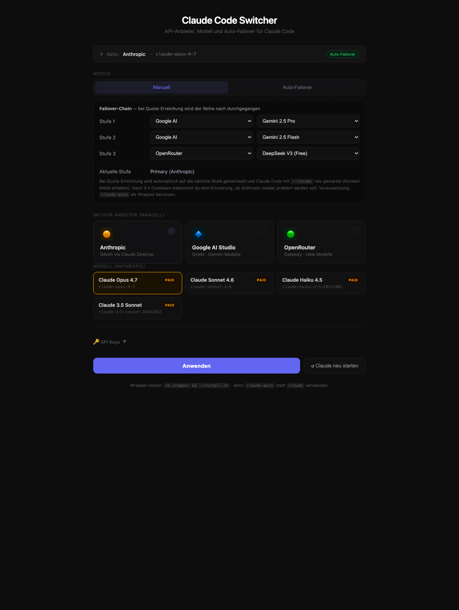
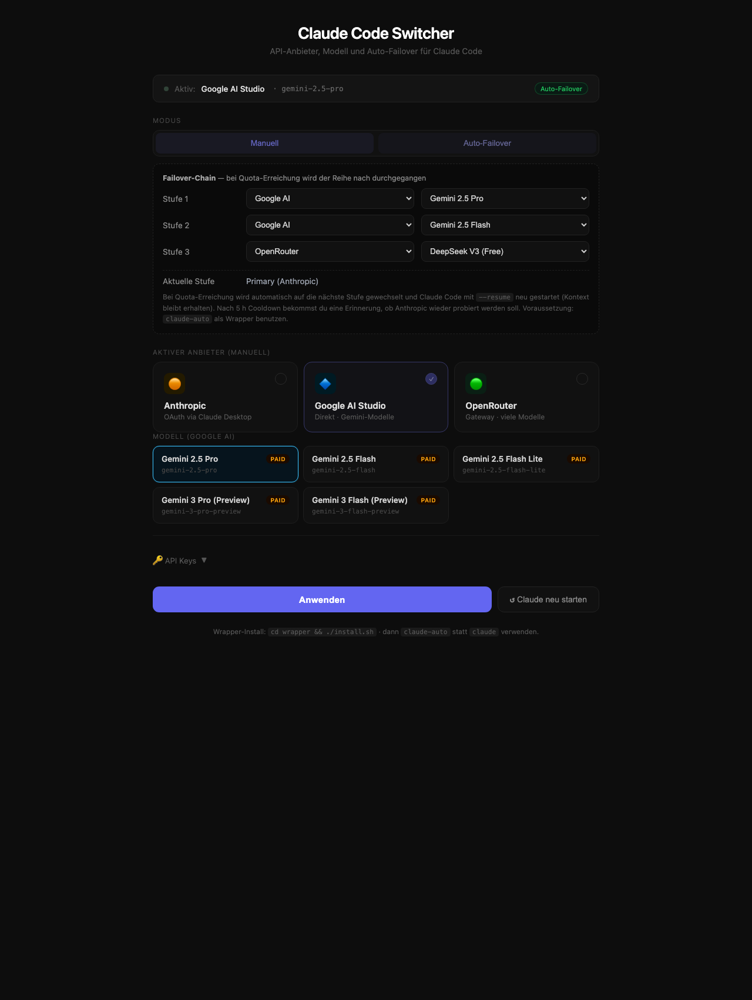
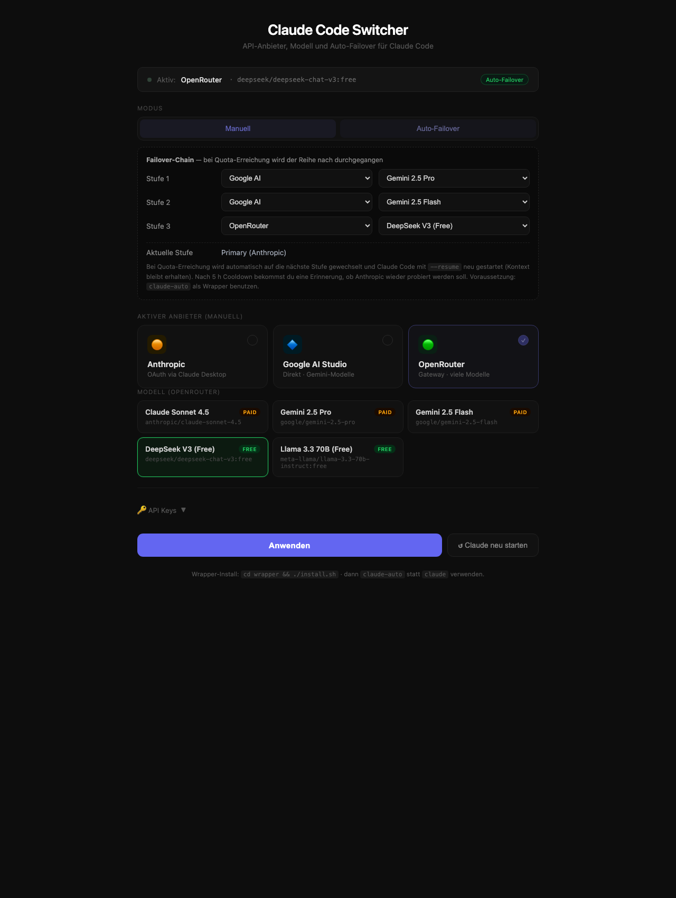

# Claude Code Switcher

> Auto-Failover für [Claude Code](https://claude.com/claude-code): wenn dein Anthropic-Pro/Max-Quota leerläuft, wechselt das Tool automatisch auf Gemini (oder OpenRouter) und springt nach Cooldown selbst zurück. **Du tippst weiterhin nur `claude`** im Terminal — der Chat-Verlauf bleibt erhalten.


*Web-UI auf `http://localhost:3000` — Failover-Chain editierbar, Provider/Modell jederzeit manuell wechselbar.*

### Modell-Auswahl pro Provider

<table>
<tr>
<td width="33%">

**Anthropic — Claude-Modelle**



Opus, Sonnet 4.6, Haiku 4.5, Claude 3.5 Sonnet

</td>
<td width="33%">

**Google AI — Gemini-Modelle**



Gemini 2.5 Pro/Flash/Flash-Lite, Gemini 3 Pro/Flash (Preview)

</td>
<td width="33%">

**OpenRouter — Mix**



Claude Sonnet 4.5, Gemini 2.5 Pro/Flash, DeepSeek V3 (Free), Llama 3.3 70B (Free)

</td>
</tr>
</table>

---

## Inhalt

- [Was es macht](#was-es-macht)
- [Wie es funktioniert — die Café-Analogie](#wie-es-funktioniert--die-café-analogie)
- [Quick Start](#quick-start)
- [Setup macOS / Linux](#setup-macos--linux)
- [Setup Windows (PowerShell)](#setup-windows-powershell)
- [UI bedienen](#ui-bedienen)
- [Failover-Chain](#failover-chain)
- [Was kostet was](#was-kostet-was)
- [Datenschutz](#datenschutz)
- [Architektur](#architektur)
- [Trade-offs](#trade-offs)
- [Troubleshooting](#troubleshooting)

---

## Was es macht

- Du arbeitest mit `claude` wie immer.
- **Bei ~ 90 % Quota** → macOS/Windows-Notification + UI-Banner. Du entscheidest selbst.
- **Bei 100 % Quota** → automatischer Switch zur nächsten Failover-Stufe (Default: Gemini 2.5 Pro). Claude wird mit `--resume` neu gestartet, Kontext bleibt voll erhalten.
- **Alle 30 min** wird probiert ob Anthropic wieder verfügbar ist — sobald ja, automatisch zurück (kostenlos).

Default-Chain: `Anthropic Pro/Max → Gemini 2.5 Pro → Gemini 2.5 Flash → DeepSeek free`. Im UI editierbar.

---

## Wie es funktioniert — die Café-Analogie

Stell dir vor, du sitzt in einem Coworking-Café und brauchst einen Berater der dir beim Programmieren hilft. Im Café arbeiten drei Berater:

| Wer | Wie er bezahlt wird | Wie viele Fragen pro Tag? |
|---|---|---|
| 🟠 **Anton** (Anthropic Claude) | dein Monats-Abo, du zahlst nichts extra pro Frage | begrenzt — irgendwann sagt er „Pause, in 5 h wieder" |
| 🔷 **Gabi** (Google Gemini) | pro Frage ein paar Cent | praktisch unbegrenzt |
| 🟢 **Dieter** (DeepSeek) | gratis | sehr begrenzt, langsam, manchmal komisch |

### Vor diesem Tool — das alte Problem

```
09:00 ─ Du gehst zu Anton ──► arbeitest
11:30 ─ Anton: "Pause! In 5 h wieder."
        Du steckst fest. Wartest. Verlierst Zeit. 😤
14:00 ─ Anton ist wieder frei ──► weiterarbeiten
```

Dazwischen 2,5 Stunden Zwangspause — oder du musst manuell zu Gabi gehen, ihr alles neu erklären, deinen ganzen Stand schildern.

### Mit diesem Tool

Du tippst weiterhin nur `claude`. Im Hintergrund läuft ein „unsichtbarer Assistent" mit, der drei Sachen macht:

```
┌───────────────────────────────────────────────────────────┐
│  1. ZUHÖREN                                              │
│     Hört dem Berater zu und merkt wenn der sagt          │
│     "ich bin fast leer" (90 %) oder "Pause!" (100 %)     │
└───────────────────────────────────────────────────────────┘
                          ▼
┌───────────────────────────────────────────────────────────┐
│  2. UMSCHALTEN                                           │
│     Bei "Pause!" schubst er Anton vom Tisch und          │
│     setzt Gabi hin. Gabi kriegt blitzschnell den         │
│     bisherigen Gesprächsverlauf in die Hand gedrückt     │
│     und macht nahtlos weiter.                            │
└───────────────────────────────────────────────────────────┘
                          ▼
┌───────────────────────────────────────────────────────────┐
│  3. BEOBACHTEN                                           │
│     Alle 30 Minuten geht er rüber zu Anton und schaut    │
│     "bist du wieder bereit?" Sobald ja — Gabi geht,      │
│     Anton kommt zurück. Wieder kostenlos für dich.       │
└───────────────────────────────────────────────────────────┘
```

### Beispiel-Tag

```
09:00 ─ Du tippst `claude`, Anton hilft dir              💰 0 €
11:30 ─ Anton: "Pause!" → Switcher schubst zu Gabi
        Du merkst nur kurz: Claude wird neu gestartet (5 s)
        Du tippst weiter genau wo du aufgehört hast
12:00 ─ Switcher checkt: Anton noch in Pause? → ja
12:30 ─ Switcher checkt: Anton noch in Pause? → ja
13:00 ─ Switcher checkt: Anton noch in Pause? → ja
13:30 ─ Switcher checkt: Anton noch in Pause? → ja
14:00 ─ Switcher checkt: Anton bereit! → Gabi geht,
        Anton ist wieder da. Du arbeitest weiter.        💰 0 €
        Du warst 2,5 h auf Gabi → Kosten ~ 1,50 €
```

---

## Quick Start

**Voraussetzungen:**
- [Docker Desktop](https://www.docker.com/products/docker-desktop/) (macOS, Windows oder Linux)
- Anthropic Pro/Max Account (für die kostenlose Hauptstufe)
- Google AI Studio API-Key mit Billing aktiv ([aistudio.google.com/apikey](https://aistudio.google.com/apikey))
- OpenRouter API-Key (auch für die `:free`-Modelle nötig — [openrouter.ai/keys](https://openrouter.ai/keys))
- Claude Code installiert ([claude.com/claude-code](https://claude.com/claude-code))

**Drei-Schritte-Setup:**

```bash
git clone git@github.com:4dataclub/claude-code-switcher.git
cd claude-code-switcher
docker compose up -d --build
# UI öffnen, Keys eintragen → Wrapper installieren → fertig
```

Oder ohne git, **nur zwei Files**:

```bash
curl -O https://raw.githubusercontent.com/4dataclub/claude-code-switcher/main/setup.sh
curl -O https://raw.githubusercontent.com/4dataclub/claude-code-switcher/main/README.md
bash setup.sh
cd claude-switcher
docker compose up -d --build
```

---

## Setup macOS / Linux

```bash
# 1. Klonen + hochfahren
git clone git@github.com:4dataclub/claude-code-switcher.git
cd claude-code-switcher
docker compose up -d --build

# 2. UI öffnen, alle 3 Keys eintragen, Modus auf "Auto" stellen
open http://localhost:3000

# 3. Wrapper installieren (setzt Alias `claude` → claude-auto in deiner ~/.zshrc)
cd wrapper && ./install.sh

# 4. Terminal neu öffnen, dann:
claude
```

---

## Setup Windows (PowerShell)

```powershell
# 1. Klonen (z.B. unter $env:USERPROFILE\Code\)
cd $env:USERPROFILE\Code
git clone git@github.com:4dataclub/claude-code-switcher.git
cd claude-code-switcher

# 2. Docker hochfahren (Docker Desktop muss mit WSL2-Backend laufen)
docker compose up -d --build

# 3. UI öffnen
Start-Process "http://localhost:3000"

# 4. Wrapper installieren (setzt Funktion `claude` → claude-auto.ps1 im Profil)
cd wrapper
.\install.ps1

# 5. Optional für hübsche Notifications:
Install-Module -Name BurntToast -Scope CurrentUser -Force

# 6. PowerShell neu öffnen, dann:
claude
```

Falls du `bash setup.sh` auf Windows direkt nutzen willst → [Git for Windows](https://git-scm.com/download/win) installieren (bringt Git Bash mit) oder WSL2 nutzen.

---

## UI bedienen

`http://localhost:3000` zeigt:

1. **Status-Zeile** oben: aktueller Provider, Modell, Modus, Position in der Failover-Chain.
2. **Modus-Toggle**: Manuell ↔ Auto-Failover.
3. **Failover-Chain** (im Auto-Modus): drei Stufen, je editierbar (Provider + Modell).
4. **Provider-Cards**: Anthropic / Google AI Studio / OpenRouter — anklicken für manuellen Switch.
5. **Modell-Auswahl**: passend zum gewählten Provider.
6. **API Keys** (aufklappbar): drei Felder. **Anthropic-Feld kann leer bleiben** wenn du Pro/Max nutzt (OAuth via Claude Desktop wird automatisch genutzt).
7. **Anwenden** → speichert alles in `~/.claude/settings.json` (`_switcher`-Block).

---

## Failover-Chain

Default-Reihenfolge wenn Anthropic-Quota leer ist:

| Stufe | Provider | Modell | Kosten/Session¹ | Hinweis |
|---|---|---|---|---|
| 0 | Anthropic | OAuth (Pro/Max) | im Abo enthalten | beste Tool-Use-Qualität |
| 1 | Google AI | `gemini-2.5-pro` | ~ 1,00 € | Reasoning immer an |
| 2 | Google AI | `gemini-2.5-flash` | ~ 0,28 € | ¼ Pro-Kosten, gute Code-Qualität |
| 3 | OpenRouter | `deepseek/deepseek-chat-v3:free` | 0 € | rate-limited, Notnagel |

¹ Schätzung für ~500 K Input + 50 K Output Tokens. Tatsächliche Kosten variieren.

Im UI editierbar — du kannst je Stufe Provider und Modell ändern.

---

## Was kostet was

### Pro durchschnittliche 1–2-Stunden-Coding-Session

| Modell | Kosten | Vergleich |
|---|---|---|
| Anthropic (Pro/Max-Abo) | 0 € | im Abo enthalten |
| Gemini 2.5 Pro | ~ 1,00 € | wie ein Cappuccino |
| Gemini 2.5 Flash | ~ 0,28 € | wie ein Stück Kaugummi |
| Gemini 2.5 Flash Lite | ~ 0,07 € | Centbetrag |
| DeepSeek free | 0 € | aber: oft „kann gerade nicht antworten" |

### Was ist eine „Session"?

Eine Session = von „claude starten" bis „claude beenden". Typisch 30 Min – 2 h Arbeit. Vergleichbar mit einem längeren WhatsApp-Chat zu einem Thema.

**Wichtig zur Abrechnung:** Bei jeder neuen Frage liest der Berater den ganzen bisherigen Gesprächsverlauf nochmal durch — und stellt das in Rechnung. Wie eine Pizza die du teilst: jedes neue Stück = du zahlst irgendwie auch nochmal für die ganze Pizza. **Längere Sessions kosten überproportional mehr als kurze.**

### Realistische Tagesabläufe

| Szenario | Tag | Mehrkosten |
|---|---|---|
| **Typischer Tag** | 4 h, 2 Sessions, Anthropic reicht | 0 € |
| **Produktiver Tag** | 8 h, nachmittags Anthropic leer, 2 Sessions auf Gemini Pro | ~ 2 € |
| **Intensiver Tag** | 10 h durchgehend, mittags leer, ganzen Nachmittag Pro | ~ 5 € |
| **Worst Case** | Anthropic-Outage, ganzen Tag nur Gemini Pro | ~ 5–6 € |

**Realistisch übers Jahr:** Wenn 1–2× pro Woche das Anthropic-Quota leerläuft → 5–15 € Mehrkosten / Monat.

### Geschwindigkeit

| Aktion | Claude | Gemini Pro | Gemini Flash |
|---|---|---|---|
| Erste Antwort kommt nach… | 1–3 s | **5–15 s** (Thinking läuft) | 1–3 s |
| Code-Edit ausführen | sofort, präzise | etwas zögerlich | flott, aber „schlampiger" |
| Mehrstufige Aufgabe (Plan + 5 Edits) | 2–4 Min | 4–7 Min | 3–5 Min |

Pro fühlt sich wie 1,5–2× langsamer pro Antwort an. Bei einfachen Edits kein Unterschied. Bei komplexen Tasks: ~ 20–40 % mehr eigene Steuerung nötig.

---

## Datenschutz

### Free vs. Paid Tier (Google AI Studio)

| Tier | Training auf Inputs? | Erkennen? |
|---|---|---|
| Free | **Ja** (offizielle Policy) | Concurrency-Test: 3+ parallele Requests → einige werfen HTTP 429 |
| Paid (Billing aktiv) | **Nein** | Concurrency-Test: alle 200 OK |

Den API-Tier-Status checkst du in [console.cloud.google.com/billing](https://console.cloud.google.com/billing) — wenn das mit dem AI-Studio-Projekt verknüpfte Cloud-Projekt einen Billing-Account hat, ist Paid aktiv.

**Family-Plan ≠ API-Tier.** Gemini Advanced (Web-UI im Family-Plan) und Google AI Studio API sind unabhängig.

### Was Google paid zusätzlich tut (vs. nicht tut)

| Aktion | Paid Gemini API | Anthropic (zum Vergleich) |
|---|---|---|
| Zum Training nutzen | ❌ Nein | ❌ Nein |
| An Dritte weitergeben | ❌ Nein | ❌ Nein |
| Kurzzeitig speichern für Missbrauchs-Erkennung | ✅ ~ 24 h, in seltenen Fällen länger bei flagged content | ✅ ~ 30 Tage |
| Von Mitarbeitern einsehbar | ⚠️ Nur bei Security-Incidents (signed access logs) | ⚠️ Gleiche Praxis |

**Praktisches Fazit:** Paid Gemini ≈ Anthropic-Niveau. Für reguläres Coding bedenkenlos. Für streng vertrauliche Daten (Bankgeheimnisse, Patientendaten, Kunden-Geheimnisse) gilt für beide Provider: Datenschutzbeauftragten fragen.

---

## Architektur

```
┌─────────────────────────────────────────────────────────────────────┐
│ claude-auto (Bash- bzw. PowerShell-Wrapper)                         │
│   • startet `claude`, hält stdin/stdout/stderr durch                │
│   • Background-Watcher 1: parst stderr nach 90 % / Quota-Patterns   │
│   • Background-Watcher 2: pollt ~/.claude/.switcher-restart Marker  │
│   • Restart-Logik: kill claude → claude --resume <session>          │
└────────┬────────────────────────────────────────────────────────────┘
         │ HTTP zu localhost:3000
         ▼
┌─────────────────────────────────────────────────────────────────────┐
│ Switcher-Server (Docker-Container, Express auf :3000)               │
│   • UI: http://localhost:3000                                       │
│   • API: /api/switch /api/auto /api/quota-error /api/warn …        │
│   • State: ~/.claude/settings.json (._switcher block)               │
│   • Background-Timer: alle 30 min Auto-Promote-Check                │
│   • Schreibt router-config.json + restartet Router-Container        │
│     via Docker-Socket                                               │
└────────┬────────────────────────────────────────────────────────────┘
         │
         ▼
┌─────────────────────────────────────────────────────────────────────┐
│ claude-code-router (Docker-Container, ccr auf :3456)                │
│   • Image: node:20-alpine + npm i -g @musistudio/claude-code-router │
│   • Übersetzt Anthropic-Messages-API ↔ Google AI / OpenRouter       │
│   • Wird nur genutzt wenn Provider ≠ Anthropic                      │
└─────────────────────────────────────────────────────────────────────┘
```

**Anthropic-Modus läuft nicht durch den Router** — OAuth (Pro/Max) braucht direkten Zugriff auf `api.anthropic.com`, weil Claude Desktop die Tokens verwaltet.

### Chat-History bleibt erhalten

Claude Code persistiert jede Session als JSONL-Datei in `~/.claude/projects/<encoded-cwd>/<uuid>.jsonl`. Beim Restart findet der Wrapper die zuletzt-modifizierte JSONL und ruft `claude --resume <uuid>` auf. Das neue Modell liest die volle History inkl. Tool-Calls und kann nahtlos weiterarbeiten.

### API-Endpunkte

| Endpoint | Methode | Zweck |
|---|---|---|
| `/api/status` | GET | aktueller Provider, Modell, Modus, Chain-Position, Keys (masked) |
| `/api/switch` | POST | manueller Provider/Modell-Switch |
| `/api/auto` | GET/POST | Auto-Modus an/aus, Chain editieren |
| `/api/quota-error` | POST | Wrapper meldet 429 → Server rückt Chain vor |
| `/api/warn` | POST | Wrapper meldet 90 %-Pattern |
| `/api/chain-promote` | POST | manueller Reset zu Anthropic |
| `/api/recheck-now` | POST | erzwingt sofortiges Auto-Promote (Cooldown übergehen) |
| `/api/events` | GET (SSE) | Live-Updates an UI |

---

## Trade-offs

- **stderr-Parsing fragil** — die Patterns in `wrapper/claude-auto` (`WARN_RE` / `ERROR_RE`) sind editierbar falls Anthropic die Wortwahl seiner Quota-Warnungen ändert.
- **Keine offizielle Pre-Quota-API für Pro/Max-OAuth.** Anthropic stellt kein Subscription-Usage-Endpoint bereit — die einzige Quelle ist der Live-Output von Claude Code.
- **Kein OAuth-Pass-through-Proxy** für den Anthropic-Modus implementiert. Würde exakte Rate-Limit-Headers liefern, aber Token-Refresh-Konflikt mit Claude Desktop ist riskant.
- **Docker-Socket-Mount** im Switcher-Container nötig für Router-Restart → effektiv Root-Rechte. Lokales Dev-Tool, **nicht** auf Server deployen.
- **Cooldown ist time-based**, nicht API-probed. Nach 30 min wird einfach versucht — wenn Anthropic noch voll, kostet der Doppel-Restart ~ 10 s.
- **Mehrere parallele `claude-auto`-Instanzen** können beim Restart die falsche Session resumen (`latest jsonl`-Heuristik).
- **Pro-Modelle haben Reasoning immer aktiv** → ~ 3× Output-Token-Kosten gegenüber Flash.

---

## Troubleshooting

**„Provider zeigt OpenRouter/DeepSeek statt Anthropic"** — manuell im UI auf Anthropic klicken + Anwenden, oder:
```bash
curl -X POST http://localhost:3000/api/chain-promote
```

**Router-Container restartet ständig** — `docker compose down && docker compose up -d --build`. Sollte mit dem aktuellen `command:` im `docker-compose.yml` stabil sein (Daemon-Watching via `pgrep`).

**„Quota erreicht" ohne dass etwas switcht** — Auto-Modus muss im UI aktiv sein. Status checken:
```bash
curl http://localhost:3000/api/status
```

**Windows-Notifications kommen nicht** — `Install-Module BurntToast -Scope CurrentUser` ausführen, oder im Konsolen-Output nach `▸ Switcher:`-Meldungen Ausschau halten.

**`bash setup.sh` funktioniert auf Windows nicht** — [Git for Windows](https://git-scm.com/download/win) installieren bringt Git Bash mit, oder WSL2 nutzen.

**Container-Namen-Konflikt nach Setup-Wechsel** — alte Container räumen:
```bash
docker stop claude-switcher-claude-switcher-1 claude-switcher-router-1
docker rm   claude-switcher-claude-switcher-1 claude-switcher-router-1
```

**Settings/Keys gehen verloren** — sie liegen in `~/.claude/settings.json` (`_switcher`-Block). Backup machen wenn dir die Konfiguration wichtig ist. Container-Restart löscht nichts, nur explizites `rm -rf ~/.claude/router-config.json` würde die Router-Config killen.

---

## Stoppen / Aufräumen

```bash
docker compose down                          # Container weg, Image bleibt
docker compose down --rmi all -v             # auch Image + Volumes weg
```

Wrapper-Alias entfernen: die Zeilen zwischen `# === claude-switcher ===` und `# === /claude-switcher ===` aus `~/.zshrc` (macOS) bzw. `$PROFILE.CurrentUserAllHosts` (Windows) löschen.

---

## Sicherheit

- **Niemals** `~/.claude/settings.json` committen — enthält API-Keys.
- **Niemals** Keys in Notizen, Screenshots oder Issues posten.
- Bei versehentlichem Push: Key sofort revoken, dann `git filter-repo --replace-text` oder BFG für die Git-History.
- `.gitignore` blockiert `settings.json`, `.env`, `router-config.json` — aber prüfe vor jedem Commit nochmal mit `git status` was du hochlädst.

---

## License

MIT — siehe [LICENSE](LICENSE) (sofern vorhanden) oder Standard-MIT-Klausel: free to use, modify, distribute, no warranty.

---

## Mitarbeit

Issues + Pull Requests willkommen. Vor allem für:

- bessere stderr-Patterns wenn Anthropic seine Wortwahl ändert
- Provider-Konfigurationen für weitere Anbieter
- Sauberer OAuth-Pass-through-Proxy für exakte Pre-Quota-Detection
- UI-Übersetzungen
